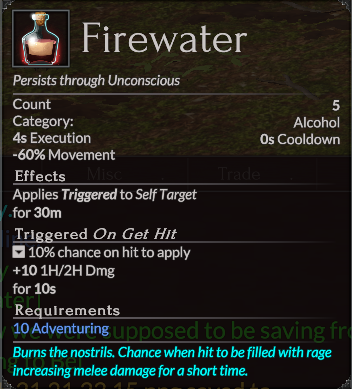
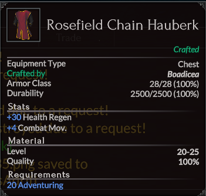
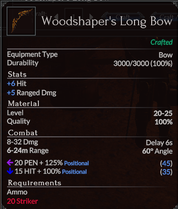
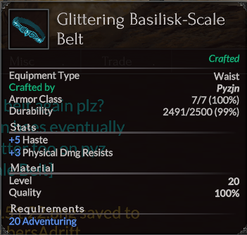
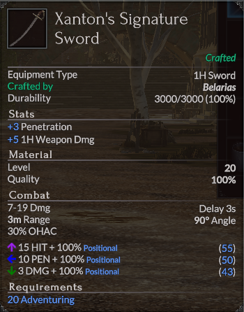
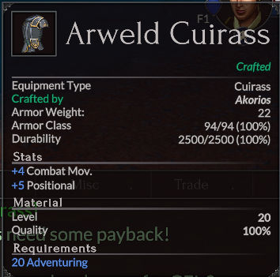

# Crafting Quests

There are six crafting quests, one for each of the crafting professions. You must be level 20 in a crafting profession to get the quest. All of the quests start with an NPC in New Haven City.

Completing each quest rewards a soulbound item to the crafter and recipes to make a slightly worse tradable version of the same item. Crafting the tradable item requires the same ingredients as the quest (with some exceptions in quantity), except that the tradable items also require three Dense Ember Flux, excluding Firewater which does not require flux.

## Provisioner
[Brewing Up History](/quests/brewing-up-history)

Requires:

- 5x Recently Eaten Grains
- 3x Gelatinous Mire Goo
- 1x Barrel of Pure Spring Water
- 1x Fiery Ant Nectar

## Outfitting
[Fit For An Outfitter](/quests/fit-for-an-outfitter)

Requires:

- 2x Supple Spider Silk
- 4x Wolf Fur
- 6x Inert Slagrock
- 3x Dense Ember Flux

## Woodworker
[The Woodshaper's Request](/quests/the-woodshapers-request)

Requires:

- 4x Seasoned Wood
- 1x Supple Spider Silk
- 2x Sticky Frog Tongue
- 3x Dense Ember Flux

## Tinker
[Tinker's Tailor-Made Supplies](/quests/tinkers-tailor-made-supplies)

Requires:

- 1x Basilisk Scales
- 1x Intact Ant Carapace
- 2x Rockscale Hide
- 3x Dense Ember Flux

## Weaponsmith
[The Blade Remade](/quests/the-blade-remade)

Requires:

- 2x Calcified Spider Fangs
- 2x Intact Fire Ant Carapace
- 2x Soft Wolf Fur
- 3x Dense Ember Flux

## Armorsmith
[Restoring a Legacy](/quests/restoring-a-legacy)

Requires:

- 4x Grub Bat Hide
- 6x Rockscale Hide

